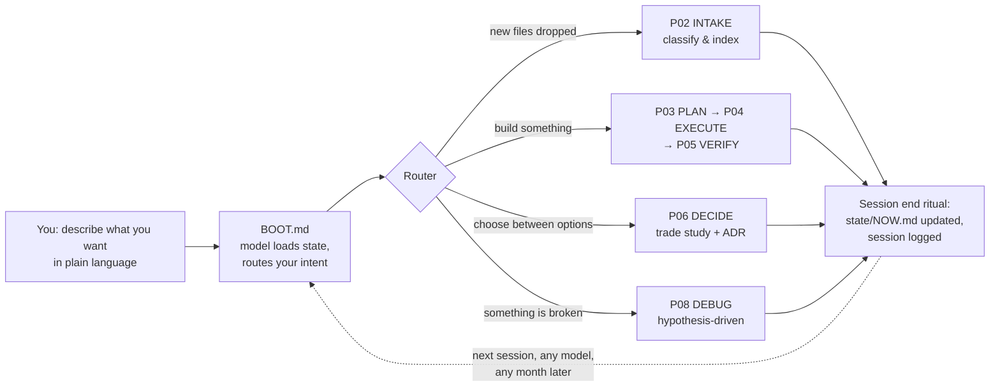

<p align="center"></p>

# RIDER

**An operating system for engineering projects, where the AI is only the execution engine.**

[](https://github.com/Rajatpuri7/rider-os/actions/workflows/validate.yml)
[](LICENSE)
[](CONTRIBUTING.md)
[](rider-master/kernel/PROMPTS.md)

RIDER (**R**easoning-**I**ntegrated **D**irectory for **E**ngineering **R**igor) is a
project directory that makes AI models work like disciplined senior engineers.
The intelligence lives in the files — boot sequences, laws, protocols, failure-mode
checklists, state management, verification gates — not in the model. Drop a cheap
model into it and it plans before building, cites evidence before claiming,
verifies before declaring done, and picks up exactly where it left off, even
months later.

> **The horse and the rider.** Think of the AI model as a horse and this folder
> architecture as the rider who knows exactly how to ride it — getting the
> maximum potential out of whatever horse it's given. Or in Formula 1 terms:
> RIDER is Max Verstappen and the AI is the car — no matter which car you hand
> him, he drives it to its fullest potential. RIDER doesn't make the model
> smarter; it makes any model perform at its limit.

---

## Why this exists

Every AI coding agent has the same failure modes, regardless of price tier:

| Failure | What it looks like |
|---|---|
| Context amnesia | Contradicts last week's decisions; re-does finished work |
| Confident fabrication | Precise-sounding APIs, pinouts, and numbers with no source |
| Verification theater | *"This should work now"* — it was never run |
| Scope creep | "I also refactored…" — you asked for one fix |
| Premature action | Code in the first minute, understanding never |

You can't fix these by buying a bigger model — frontier models do all of the above,
just more eloquently. You fix them the way engineering organizations always have:
**with process that doesn't depend on the talent of the individual.** RIDER encodes
that process into a directory any model can be dropped into.

## How it works



Three mechanisms do the heavy lifting:

1. **Externalized memory.** All project state lives in files (`state/NOW.md`,
   decision records, risk registers, session logs) — never in a context window.
   Any model resumes losslessly.
2. **Procedure over judgment.** Weak models fail at open-ended judgment but follow
   checklists well. Eleven numbered protocols cover planning, execution,
   verification, decisions, research, debugging, audits, and environment setup.
3. **Gates, not vibes.** No work without a task file. No "done" without recorded
   evidence. No decision without alternatives considered. A validator
   (`ops/validate.py`) mechanically catches structural rot.

## Quick start (5 minutes)

You don't install RIDER — it's a folder you copy. One copy per project.

**Step 1 — Get the template** (pick either)

- Click the green **"Use this template"** button on GitHub, or
- ```bash
  git clone https://github.com/Rajatpuri7/rider-os.git
  cp -r rider-os/rider-master my-project     # Windows: xcopy /E /I rider-os\rider-master my-project
  ```

Your project = the copied `rider-master` folder, renamed to anything you like.

**Step 2 — Dump your files in.** Drag every file you have — papers, datasheets,
CAD, code, notes, images, requirements — into `my-project/intake/inbox/`.
**Don't organize anything yourself.** Sorting them is the AI's job.

**Step 3 — Open the folder with any AI agent and say:**

> *"Initialize this project."*

The agent reads its entry file ([CLAUDE.md](rider-master/CLAUDE.md) /
[AGENTS.md](rider-master/AGENTS.md) / [GEMINI.md](rider-master/GEMINI.md))
automatically, interviews you about the project, classifies your inbox files,
detects the tools you need, and sets up the project state.

**Step 4 — Just talk.** From now on, open the folder and describe what you
want in plain language — no commands or protocol names to learn:

| You say | The system runs |
|---|---|
| "Give me a status briefing" | boot + summary of state, risks, open questions |
| "Plan the perception module" | planning protocol with gated task breakdown |
| "Work on the active task" | disciplined execution loop |
| "Why is the sensor reading garbage?" | hypothesis-driven debugging |
| "Should we use CAN or UART here?" | trade study + recorded decision |
| "End session" | logs written, state saved for next time |

Come back tomorrow — or in six months, with a different AI — and it resumes
exactly where you left off, because all memory lives in the files.

**No agent with file access?** Web-only ChatGPT/Gemini work too:
`python ops/bundle.py` generates a paste-able context pack. See
[kernel/PROMPTS.md](rider-master/kernel/PROMPTS.md).

**Requirements:** none. Optionally Python 3.8+ for the three `ops/` helper
scripts (stdlib only, zero dependencies).

## What's inside

```
rider-master/
├── CLAUDE.md · AGENTS.md · GEMINI.md   ← agent entry points (identical)
├── MAP.md                              ← where every artifact lives, and why
├── PROJECT_PROFILE.yaml                ← machine-readable project identity
├── kernel/                             ← the operating system (changes rarely)
│   ├── BOOT.md                         ← mandatory session boot + intent router
│   ├── LAWS.md                         ← 12 inviolable rules
│   ├── FAILURE-MODES.md                ← known AI failure modes + countermeasures
│   ├── PROMPTS.md                      ← copy-paste prompts for chat-only models
│   ├── protocols/  P01–P11             ← initialize, intake, plan, execute, verify,
│   │                                     decide, research, debug, audit, subsystem, env
│   ├── templates/                      ← TASK, ADR, TRADE-STUDY, TEST-PLAN, …
│   └── playbooks/                      ← 11 domain guides (robotics, embedded, ML, CV,
│                                         electronics, CAD, controls, simulation, …)
├── state/                              ← live memory: NOW, questions, risks, lessons
├── knowledge/                          ← requirements, decisions (ADRs), research, refs
├── planning/                           ← backlog → active (max 3) → done
├── intake/                             ← drop zone: inbox → classified into the tree
├── subsystems/                         ← one folder per loosely-coupled subsystem
├── integration/                        ← cross-subsystem interfaces (never inside one)
├── verification/                       ← test plans, reports, raw evidence
├── env/                                ← toolchain manifest, checked by ops/doctor.py
└── ops/                                ← validate.py · doctor.py · bundle.py (stdlib only)
```

Domain-agnostic by design: robotics, ADAS, embedded, electronics, CAD, controls,
computer vision, ML, simulation, research, or plain software — the kernel is the
same; playbooks and the project profile adapt it.

## Example session

```text
You:   "The IMU driver returns garbage after a few minutes."

Agent: ORIENTATION
       Project: quadruped — 12-DOF walking robot
       Now:     gait tuning paused, waiting on load cells
       Asked:   debug IMU driver corruption after ~minutes of runtime
       Protocol: P08-DEBUG
       Concerns: LESSONS.md notes a past I2C bus contention issue — related?

       Known vs assumed: [3 facts, 2 assumptions listed]
       Hypotheses, ranked: (1) I2C clock stretching timeout [prior lesson],
       (2) buffer overflow in ring buffer, (3) sensor thermal drift, (4) …
       Cheapest discriminating test for #1: …
```

No "try turning it off and on." The protocol forces known-vs-assumed, ranked
hypotheses, and one experiment at a time — from *any* model.

## Philosophy

- **The system is the senior engineer; the model is the hands.** Good
  organizations get reliable output from variable talent via process. RIDER is
  that process, made machine-readable.
- **Files are the only memory that survives.** Context windows die; directories
  don't. Everything load-bearing gets exactly one home on disk (`MAP.md` decides).
- **Every rule is scar tissue.** Each law, protocol step, and failure-mode entry
  exists because models reliably fail without it. `kernel/META.md` defines the
  harvest ritual: lessons from every project flow back into the master, so the
  system compounds.
- **Metered context beats maximal context.** Protocols specify exactly which
  files to read per job — enough to be right, little enough not to drown.

## FAQ

**Is this a framework, an agent, or a prompt library?**
None. It's a directory template. No runtime, no server, no dependencies. The
three Python scripts are optional conveniences.

**Which models does it work with?**
Any agent that can read files (Claude Code, Codex CLI, Gemini CLI, Cursor,
Windsurf, Aider, …) via the entry files, and any chat-only model via
`ops/bundle.py` context packs. Cheaper models benefit *most* — that's the point.

**How is this different from a `CLAUDE.md` + docs folder?**
A `CLAUDE.md` gives instructions; RIDER gives *procedure with gates*. The
difference shows up on failure: intent routing, WIP caps, evidence-gated
completion, structured session ends, a mechanical validator, and state that
survives between sessions and between models.

**Does it work for non-engineering projects?**
It's tuned for engineering (hardware-aware failure modes, interface control,
verification discipline), but the kernel is domain-agnostic. Add a playbook for
your domain (`kernel/META.md` § Extension points).

**Isn't reading protocols a waste of tokens?**
Boot costs ~2 minutes of reading. Un-booted sessions cost hours of re-explaining
context and re-doing work. The protocols exist precisely to *meter* what gets
read.

## Troubleshooting

| Symptom | Fix |
|---|---|
| Agent ignores the system and freestyles | Say: *"Read CLAUDE.md and follow it exactly."* That instruction is the one irreducible manual act. |
| `validate.py` reports errors | Read the messages — each names the file and the rule. Fix, re-run. Exit 0 = clean. |
| `doctor.py` says manifest is empty | Expected on a fresh copy. Run P11 ("check my environment") to derive the toolchain first. |
| Garbled characters on Windows console | Fixed in the scripts (UTF-8 forced). If it persists: `set PYTHONUTF8=1`. |
| Agent asks endless questions | Point it to LAWS + G9: questions must be batched and answered from `knowledge/` first. |
| Two agents disagree with each other | Files win. `state/NOW.md` and `knowledge/decisions/` are authoritative over any model's opinion. |

## Roadmap

- [ ] `ops/init.py` — interactive first-copy wizard (rename, profile, git init)
- [ ] Optional auto-install mode for `doctor.py` (`--fix`, behind explicit consent)
- [ ] More domain playbooks (web/backend, data engineering, bio/lab)
- [ ] Community playbook & template gallery
- [ ] Multi-agent coordination protocol (several agents, one RIDER tree)

Vote or propose in [Discussions](https://github.com/Rajatpuri7/rider-os/discussions).

## Contributing

The most valuable contribution is **scar tissue**: a failure mode you've watched
a model commit, with a countermeasure that works. See [CONTRIBUTING.md](CONTRIBUTING.md)
for how kernel changes are proposed (spoiler: every change must name the lesson
that drove it — the kernel refuses speculative features).

## License

[MIT](LICENSE) — use it for anything, including commercial work.

---

*RIDER was designed in a single intensive session with Claude (Fable 5), with the
explicit goal of distilling a frontier model's engineering discipline into files
that elevate any weaker model. The design brief: "the intelligence should exist
inside the system itself, not inside the AI model."*
