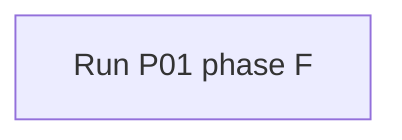

# ARCHITECTURE — the system-level view

> The one picture of how subsystems form a system. Drafted at P01 phase F,
> updated whenever subsystems or their connections change (P10). Every arrow
> below MUST have an interface doc in `interfaces/` — an arrow without a
> contract is a future integration bug (LAW L8).

## Block diagram

## Subsystem registry
| Subsystem | Purpose (one line) | State | Interfaces |
|---|---|---|---|
| — | | | |

## Flows (each row = one arrow = one interface doc)
| From | To | What flows (data/power/force/timing) | Contract |
|---|---|---|---|
| — | | | `interfaces/IF-…` |

## System-wide conventions
<Frame conventions, unit system, timebase, naming — the things every
subsystem must agree on. Link the interface docs that formalize them.>
